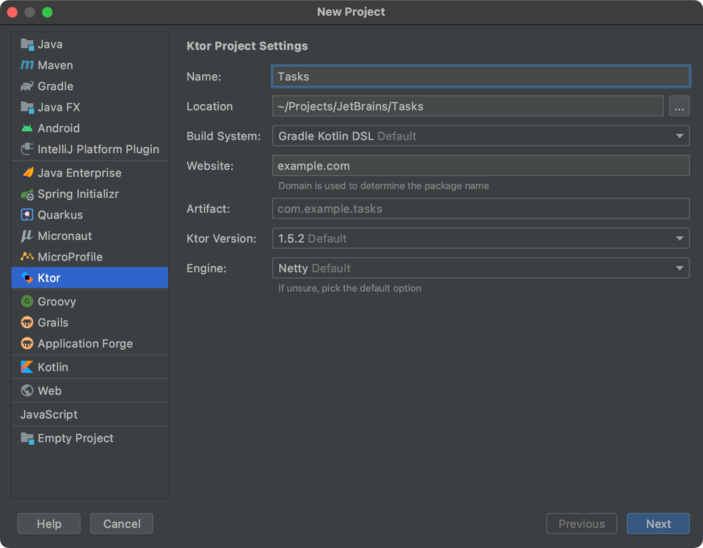
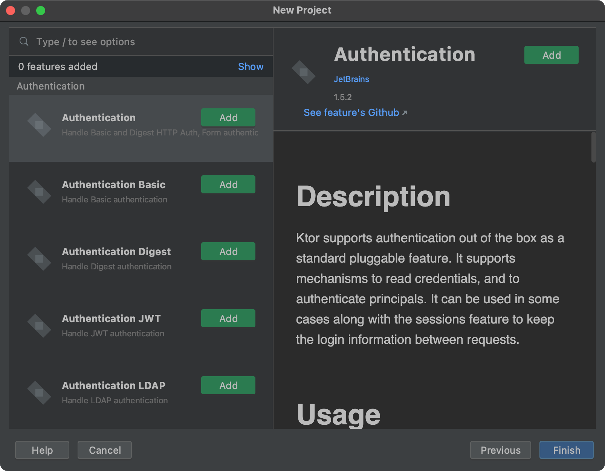

# Ktor Quick Start For An ASP.NET Developer

Folks familiar with the .NET ecosystem might take for granted the foundational libraries Microsoft has built for developers. The .NET technology stack is designed to make developers _immediately_ productive but comes at the cost of limited options and a potential for group-think. The Kotlin community, and as it relates to Ktor, is built with a different founding philosophy of community and choices. As a .NET developer coming to the Kotlin community, the vast array of options available can be daunting.

In this post, we'll build a straightforward HTTP API similar to one we might create with ASP.NET Core and identify the similarities between Ktor and ASP.NET, allowing us to compare and contrast features.

This guide is meant to be a high-level overview and we will touch on dependency management, build systems, and Kotlin syntax. It will not be a comprehensive guide on all those subjects.

Before getting started, we need to be sure we have the latest IntelliJ IDEA installed along with the Ktor plugin. We used Ktor 1.5.2 when authoring this article.

## Creating a new project

Like ASP.NET development, users will have the option of working with templates to get started with Ktor. Unlike ASP.NET development, rather than having a feature-complete template, Ktor developers get to opt-in to many features from the **New Project** dialog from within IntelliJ IDEA. The ability to *install* components gives us the ability to tackle a wide array of technical problems while adhering to YAGNI's philosophy (you ain't gonna need it).

In this article, we'll start by creating a new Ktor project, and the first thing ASP.NET developers will notice are the choices. We can set the project name, location, the build system, the JAVA version, and the host server. In this case, let's call the Name of our project `Tasks`.



For our HTTP API, we'll want to install the **GSON** and **Content Negotiation** features by adding them in the **New Project** dialog. We can ignore all other features for now.



During this dialog, folks unsure of what each feature accomplishes can highlight the item to see the documentation on the right describing the element directly.

Clicking finish, will bring us to the IntelliJ editor where we are ready to start writing code.

## Ktor Hello World

Similar to ASP.NET, Ktor applications are console hosts with an integrated server. We'll find our `Application.kt` file under the' src' folder, which has our `main` method.

```kotlin
package com.example

import io.ktor.application.*
import io.ktor.response.*
import io.ktor.request.*
import io.ktor.routing.*
import io.ktor.http.*
import io.ktor.gson.*
import io.ktor.features.*

fun main(args: Array<String>): Unit = io.ktor.server.netty.EngineMain.main(args)

@Suppress("unused") // Referenced in application.conf
@kotlin.jvm.JvmOverloads
fun Application.module(testing: Boolean = false) {
    install(ContentNegotiation) {
        gson {
        }
    }

    routing {
        get("/") {
            call.respondText("HELLO WORLD!", contentType = ContentType.Text.Plain)
        }

        get("/json/gson") {
            call.respond(mapOf("hello" to "world"))
        }
    }
}
```

Right from the start, we can see similarities to an ASP.NET Core application.

1. Our Host is declared in our `main` function and references a server. In Ktor, **Netty** is similar to **Kestrel**. In the JAVA ecosystem, we have other options.
1. Our `fun Application.module` is similar to ASP.NET Core's `Startup` class. We can configure our request pipeline similar to ASP.NET Core's  `Startup.Configure` method.
1. We `install` content negotiation. We can think of installing features as a combination of `ConfigureServices` and `Configure` in an ASP.NET Core application.

Let's go over the syntax a little bit, as it might be jarring to C# developers.

### Kotlin's Extension Everything

Kotlin shares many syntactical traits with C#, but unlike C#, Kotlin allows developers to add extensions of almost any class in function and property form. Ktor features take advantage of this Kotlin syntax feature by extending an existing module, thus creating a rich domain-specific language (DSL). Let's take a look at **routing**.

```kotlin
routing {
    get("/") {
        call.respondText("HELLO WORLD!", contentType = ContentType.Text.Plain)
    }

    get("/json/gson") {
        call.respond(mapOf("hello" to "world"))
    }
}
```

We can think of `routing` as being called on our `Application`. Calls to `get` are more extension functions, which we call on the `Routing` class. Stepping through to the underlying Ktor code, we can see the definition of `routing`.

```kotlin
public fun Application.routing(configuration: Routing.() -> Unit): Routing =
    featureOrNull(Routing)?.apply(configuration) ?: install(Routing, configuration)
```

While a full understanding of Kotlin is unnecessary, it's good to understand that what we're looking at is no different than a typical builder pattern found in C#. Kotlin just so happens to have syntax to support more terse DSLs. We can hover over syntax-highlighted variables to see how they are defined and get a better understanding of what they are as they relate to .NET and C# syntax.

### Building And Running Ktor Apps

Kotlin uses Gradle, a build tool designed to automate tasks in the JAVA ecosystem. From within IntelliJ's Gradle window, we can see what **Tasks** we can perform. Under the **application** Gradle folder, we can see the **run** task. We can right-click and select to either run or debug the task. For ASP.NET developers, this may feel similar to MSBuild, .NET's build system.

### Dependency Management

While we won't be adding dependencies to this article, it's essential to understand where we manage dependencies. In our project, we'll find a `build.gradle` file. Here, we'll see a `dependencies` section with all of our external package dependencies.

```
dependencies {
    implementation "org.jetbrains.kotlin:kotlin-stdlib-jdk8:$kotlin_version"
    implementation "io.ktor:ktor-server-netty:$ktor_version"
    implementation "ch.qos.logback:logback-classic:$logback_version"
    implementation "io.ktor:ktor-server-core:$ktor_version"
    implementation "io.ktor:ktor-gson:$ktor_version"
    testImplementation "io.ktor:ktor-server-tests:$ktor_version"
}
```

If we wanted to pull in more community features, we'd need to add an `implementation` element. Above this section, we'll see the `repositories` section, which mentions repository URLs similar to .NET's NuGet package repository.

## The Tasks HTTP API

When building an HTTP API, we're most concerned about HTTP semantics and content negotiation. HTTP semantics allow us to handle HTTP requests across all HTTP methods: GET, POST, PUT, PATCH, and DELETE. Content negotiation will enable us to both receive and respond in a specific content-type specified by the client. In most modern HTTP APIs, that means handling a JSON request and response payload.

Ktor is unopinionated about solution structure, so we get to define our own opinion. In a previous section, we talked about extension methods, and in this tutorial, we'll create a new `tasksModule` extension function, which we'll call in our `module` method. We'll also redirect our root path to hit our future tasks index action. Finally, at the bottom of the file, we'll add data classes for `Task`, `Edit`, and `Index`. These classes will be our request and response models.

```kotlin
package com.example

import io.ktor.application.*
import io.ktor.response.*
import io.ktor.request.*
import io.ktor.routing.*
import io.ktor.http.*
import io.ktor.gson.*
import io.ktor.features.*

fun main(args: Array<String>): Unit = io.ktor.server.netty.EngineMain.main(args)

@Suppress("unused") // Referenced in application.conf
@kotlin.jvm.JvmOverloads
fun Application.module(testing: Boolean = false) {
    install(ContentNegotiation) {
        gson {
        }
    }

    routing {
        get("/") {
            call.respondRedirect("/tasks", false)
        }
    }

    // tasks routes
    tasksModule()
}

fun Application.tasksModule() {
   // routes will go here
}

data class Task(val id:Int, val text: String, val complete: Boolean = false, val link: String = "/tasks/${id}")
data class Edit(val text: String, val complete: Boolean = false)
data class Index(val results: List<Task>)
```

We'll need to store our tasks in a data storage mechanism. To keep things simple, let's store tasks in-memory. We'll add the following to our `tasksModule` body.

```kotlin
// in-memory tasks
val tasks = mutableListOf(
    Task(1, "pick up groceries"),
    Task(2, "walk the dog"),
    Task(3, "cook dinner")
)
```

Next, let's take advantage of the routing DSL. We want our endpoints to have a root of `/tasks`. Below our in-memory structure, we will add the following.

```kotlin
routing {
     route("/tasks") {
         // route definitions go here
    }
}
```

Now, let's go through each of the HTTP methods of `GET`, `POST`, `PUT`, and `DELETE` and build a working HTTP API. Remember, we'll be working with the in-memory collections. Any changes will only persist as long as the process continues to run.

## Getting Tasks With HTTP GET

We'll start with our **List** method, which will return all current tasks. The `GSON` library and content negotiation work together to respond in JSON. Using the `call` class, we can return a new instance of `Index` and pass our collection of `Task` entities. It's a good practice to return a wrapper entity when dealing with collections.

```kotlin
get {
    call.respond(Index(tasks))
}
```

We can think of the `respond` method similar to ASP.NET's `Response.Write` method.

Let's move on to the other `GET` method, where we'll retrieve a single entity. In this method, you'll notice the use of the `it` variable, which is a shorthand variable. .NET folks can think of `it` as `x => x.`.

```kotlin
// tasks#get
get("{id}") {
    val id = call.parameters["id"]?.toInt()
    val task = tasks.find { it.id == id }

    if (task == null) {
        call.respond(HttpStatusCode.NotFound)
    } else {
        call.respond(task)
    }
}
```

Here we start to see how low-level Ktor is and how much closer it is to ASP.NET's middleware or endpoint routing approach instead of ASP.NET MVC or WebAPI. While we can define path parameters in our routing, we need to parse these parameters out manually and handle the potential for exceptions.

## Creating A Task With HTTP POST

Let's look at the endpoint for creating a new `Task` in our collection. We'll use the HTTP method `POST` combined with content negotiation and GSON. Our first line in our endpoint is to `call.receive`, which will read the request body and attempt to deserialize the contents.

```kotlin
// tasks#create
post {
    val request = call.receive<Edit>()

    if (request.text.isNullOrEmpty()) {
        call.respond(HttpStatusCode.BadRequest)
    } else {
        val id = tasks.maxOf { it.id } + 1
        val task = Task(id, request.text, request.complete)
        tasks.add(task)
        call.respond(HttpStatusCode.Created, task)
    }
}
```

After which, we go through the process of validating our request. The method has some necessary validation and correctly responds with the `Created` HTTP status code and the newly created entity.

## Update A Task With HTTP PUT

Updating tasks in our collection is a bit more complicated, as we'll have a little more logic. Luckily, we can reuse much of what we've learned up to this point.

```kotlin
// tasks#update
put("{id}") {
    val id = call.parameters["id"]?.toInt()
    val input = call.receive<Edit>()

    if (input.text.isNullOrEmpty()) {
        call.respond(HttpStatusCode.BadRequest)
    } else {
        val task = tasks.find {  it.id == id }
        if (task == null) {
            call.respond(HttpStatusCode.NotFound)
        } else {
            val index = tasks.indexOf(task)
            val result = Task(task.id, input.text, input.complete)
            tasks[index] = result
            call.respond(result)
        }
    }
}
```

Like our POST method, we utilize the `call` class to process both the request and response.

## Delete A Task with HTTP DELETE

We should always reconsider dangerous tasks in our HTTP API's, but seeing that this is a demonstration, let's implement `DELETE` anyways.

```kotlin
// tasks#delete
delete("{id}") {
    val id = call.parameters["id"]?.toInt()
    tasks.removeIf { it.id == id }

    // success no content
    call.respond(HttpStatusCode.NoContent)
}
```

In this endpoint, we end up using the Kotlin helper method `removeIf` to remove elements that match our criteria from the collection. In this case, we remove elements matching the `id` property.

## The Complete Ktor HTTP API

Now let's put it all together.

```kotlin
package com.example

import io.ktor.application.*
import io.ktor.response.*
import io.ktor.request.*
import io.ktor.routing.*
import io.ktor.http.*
import io.ktor.gson.*
import io.ktor.features.*

fun main(args: Array<String>): Unit = io.ktor.server.netty.EngineMain.main(args)

@Suppress("unused") // Referenced in application.conf
@kotlin.jvm.JvmOverloads
fun Application.module(testing: Boolean = false) {
    install(ContentNegotiation) {
        gson {
        }
    }

    routing {
        get("/") {
            call.respondRedirect("/tasks", false)
        }
    }

    // tasks routes
    tasksModule()
}

fun Application.tasksModule() {

    // in-memory tasks
    val tasks = mutableListOf(
        Task(1, "pick up groceries"),
        Task(2, "walk the dog"),
        Task(3, "cook dinner")
    )

    routing {
        route("/tasks") {
            // tasks#index
            get {
                call.respond(Index(tasks))
            }
            // tasks#create
            post {
                val request = call.receive<Edit>()

                if (request.text.isNullOrEmpty()) {
                    call.respond(HttpStatusCode.BadRequest)
                } else {
                    val id = tasks.maxOf { it.id } + 1
                    val task = Task(id, request.text, request.complete)
                    tasks.add(task)
                    call.respond(HttpStatusCode.Created, task)
                }
            }
            // tasks#get
            get("{id}") {
                val id = call.parameters["id"]?.toInt()
                val task = tasks.find { it.id == id }

                if (task == null) {
                    call.respond(HttpStatusCode.NotFound)
                } else {
                    call.respond(task)
                }
            }
            // tasks#update
            put("{id}") {
                val id = call.parameters["id"]?.toInt()
                val input = call.receive<Edit>()

                if (input.text.isNullOrEmpty()) {
                    call.respond(HttpStatusCode.BadRequest)
                } else {
                    val task = tasks.find { it.id == id }
                    if (task == null) {
                        call.respond(HttpStatusCode.NotFound)
                    } else {
                        val index = tasks.indexOf(task)
                        val result = Task(task.id, input.text, input.complete)
                        tasks[index] = result
                        call.respond(result)
                    }
                }
            }
            // tasks#delete
            delete("{id}") {
                val id = call.parameters["id"]?.toInt()
                tasks.removeIf { it.id == id }

                // success no content
                call.respond(HttpStatusCode.NoContent)
            }
        }
    }

}

data class Task(val id:Int, val text: String, val complete: Boolean = false, val link: String = "/tasks/${id}")
data class Edit(val text: String, val complete: Boolean = false)
data class Index(val results: List<Task>)
```

## Conclusion

We've walked through building an HTTP API using Ktor from the perspective of a developer familiar with ASP.NET Core. As mentioned previously, Ktor is unopinionated. The framework provides developers with features and very little else. The advantage is that we can choose what's valuable in our use case while not absorbing overhead that can lead to slower apps and frustrating user experiences. The downside is we may have to make more decisions and more opportunities to pick the wrong feature set. All that said, Ktor and Kotlin offer a compelling ecosystem for ASP.NET developers. I hope you found this tutorial enlightening, and we hope you continue your Ktor journey.