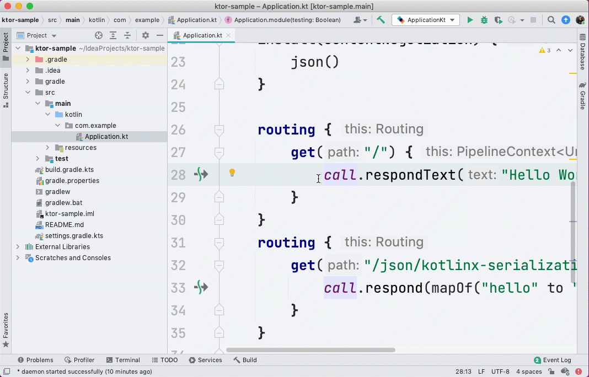

# Ktor for Laravel Developers

Welcome, artisan! Learning a new and unfamiliar technical stack can be awkward. Don't worry! the Ktor team is here to make that journey as fun and exciting as possible. You're likely reading this document because of one or all of the following reasons:

- You have a solid foundational understanding of PHP and Laravel and looking to expand your technology toolkit.
- An interest in the [Kotlin](https://kotlinlang.org/) ecosystem
- Lean towards lightweight and easy-to-learn web frameworks

If any of these reasons ring true for you, then Ktor will be a perfect option for your next web stack.

## Meet Ktor Framework

[Ktor](https://ktor.io/), pronounced _kay-tor_, is an open-source, licensed under Apache 2.0, web framework built by JetBrains and the community from the ground up using Kotlin to leverage language features such as domain-specific languages (DSLs) and coroutines. Developers from other ecosystems might see the similarities in Ktor when compared with their respective lightweight web frameworks:

- PHP has Slim
- JavaScript has Express.js
- Ruby has Sinatra
- .NET has ASP.NET Core and Carter

This article will guide you through the steps necessary for building a Ktor-powered RESTful API with SQLite database. We'll use terminologies familiar to [Laravel](https://laravel.com/) developers, making the experience friendly and providing a better understanding.

## Environment Prerequisites

Before we get started, developers will need the following development environment:

- [IntelliJ IDEA Ultimate or Community](https://www.jetbrains.com/idea/)
- [Java Development Kit (JDK)](https://www.jetbrains.com/help/idea/sdk.html) similar to PHP interpreter
- [Ktor plugin](https://plugins.jetbrains.com/plugin/16008-ktor)

Optionally, we highly recommend developers install the [JetBrains Toolbox App](https://www.jetbrains.com/toolbox-app/), which makes installing new IDEs and updating existing installations a breeze.

## Create a Ktor project

We can now create a new Ktor project using IntelliJ IDEA. First, click the Ktor tab in the New Project dialog and fill out the project information. In the next step, search and add “`Routing`”, “`ContentNegotiation`” and “`kotlinx.serialization`” features, then hit finish. IntelliJ IDEA will create a brand new Ktor project using [Gradle](https://www.jetbrains.com/help/idea/gradle.html) for you automatically. Laravel developers will find this experience similar to their use of [Composer](https://getcomposer.org/) and the commands to create a new project or add a dependency, but with Ktor, there's a graphical user interface.


On the left-hand side, we'll see the Project tool window. It contains a folder called `src`, which we will write and maintain Kotlin code. Look for and open the `Application.kt` file. You should find a `main` function which is the entry point of the Ktor application. To run the web application, press the green play button in the editor's gutter. IntelliJ IDEA will start a Gradle task to compile and run the application. Once the application is running, open the browser and navigate to `http://localhost:8080/`, at which point you will see a response of `HELLO WORLD!`. This process is similar to typing `artisan serve` in the terminal to run a Laravel application.



## Routing

Routing is foundational to all Laravel applications. If our application was a hotel, then routing is like the lobby of an application. HTTP Requests are directed to a method by path and method. In Ktor, you could define your routing using DSL syntax inside `Application.module()` function in `Application.kt`. The methods defined here dictate the behavior and response to the HTTP request.

In our initial project, we had a basic implementation of a hello world web application. Inside the `routing { }` block, we have a `get()` function that accepts the `"/"` root URL string. Ktor's DSL structures our route definitions making them easy to understand. As you, an experienced Laravel developer can anticipate, we can also use `post()`, `put()`, `patch()`, `delete()` methods to accept HTTP requests with the matching methods. Compare to Laravel, the syntax is equal to `Route::get()`, `Route::post()`, etc.

### The application call

We can define HTTP calls by their two parts: request and response. In Ktor, both the request and response are accessible using the `call` object within a route definition. We can access the request details by invoking the `call.request` method, and we can start building our response by using the `call.respond` method. Our sample code shows how Ktor responds to a plain-text request using the `call.respondText` helper method.

```
call.respondText(
    text = "HELLO WORLD!",
    contentType = ContentType.Text.Plain
)
```

We are building a RESTful API. What about writing a JSON response?

### Features

Ktor relies heavily on the interceptor pattern. Laravel developers might have used a similar middleware concept in their PHP applications.  Commonly, an interceptor will have an opportunity to handle an HTTP request as it passes through the pipeline to becoming an HTTP response. In Ktor, we usually call these interceptors **Features**. Features indicate what abilities our application has and can perform.

To enable JSON support in our Ktor application, we will need to **install** a feature called “`ContentNegotiation`” and a JSON serialization library called “`kotlinx.serialization`”. In our `Application.kt` file, Ktor provides an `install()` function that we can invoke to add any new feature. Inside the `install` function call, we can use a Kotlin closure to make additional calls and configure our feature.

```
install(ContentNegotiation) {
    json()
}
```

Laravel developers using JSON responses will regularly use arrays to structure response data. In Ktor, we can use a similar structure called `Map`. `Map` is a key-value pair and ideal for use with JSON, which itself is a key-value pair structure. Kotlin also has the `mapOf()` helper function to help us declare structures more quickly. Because we've installed the content negotiation feature, passing a map to Ktor's `call.respond` method will automatically serialize the variable into JSON.

```
get("/json/kotlinx-serialization") {
    call.respond(mapOf("hello" to "world"))
}
```

Open your browser and navigate to `http://localhost:8080/json/kotlinx-serialization`, where you will see the JSON string `{ "hello": "world" }`.

## Database integration using Exposed ORM

We've seen a simple hello-world application, but things are about to get interesting. We will build a TODO RESTful API that will store `Task` information in a database.

PHP devs might have used an ORM like Eloquent while building Laravel web applications. We'll want a data access library, but Ktor's thin and light philosophy means we don't have any ORMs by default. Ktor's lack of default data access allows us to choose for ourselves, and fortunately, there is an ORM framework called Exposed developed by JetBrains!

### Add dependencies

Before using Exposed, we need to decide which database we are going to use. For our REST API, we will use an SQLite database to store our `Task` entities. Just like managing dependencies using `composer.json`, we can define Ktor dependencies using Gradle's  
`build.gradle.kts` file. Open the `build.gradle.kts` file and add `exposed-core`, `exposed-dao`, `exposed-jdbc` for Exposed, also `sqlite-jdbc` for the SQLite driver. Our `dependencies` sections will look like this:

```
val exposed_version: String by project
val sqlite_version: String by project

// ...

dependencies {
    // ...
    implementation("org.jetbrains.exposed:exposed-core:$exposed_version")
    implementation("org.jetbrains.exposed:exposed-dao:$exposed_version")
    implementation("org.jetbrains.exposed:exposed-jdbc:$exposed_version")
    implementation("org.xerial:sqlite-jdbc:$sqlite_version")
    // ...
}
```

Here comes a tip to store package version number separately. We declared `*_version` variables in `build.gradle.kts`, then use the same variable name and version number pair in `gradle.properties`. Here is how it looks like:

```
exposed_version=0.25.1
sqlite_version=3.34.0
```

### Schema and Entity

To interact with our SQLite database, we need a Kotlin object defining the database schema. We will use the following code to perform simplified database migration and ensure we have a SQL table for our tasks.

```
object Tasks : IntIdTable("tasks") {
    val title = varchar("title", 255)
    val completed = bool("completed").default(false)
}
```

Each SQLite database table requires a corresponding "**Entity**," also known as a **Data Access Object (DAO)**. Exposed entities allow you to perform operations such as insert, update, and delete against the database schema. Just like the "Model" concept in Eloquent, Exposed simplifies the database interaction experience. Let's declare our `Task` entity class:

```
class Task(id: EntityID<Int>) : IntEntity(id) {
    companion object : IntEntityClass<Task>(Tasks)

    var title by Tasks.title
    var completed by Tasks.completed
}
```

### Create SQLite database file

We will store our `Task` data in an SQLite database. Open the Terminal tool window in IntelliJ IDEA and type the following commands to create a database folder, then a new SQLite database file.

```
$ mkdir database
$ touch database/database.sqlite
```

### Connect to an SQLite database

We need to establish a connection to our SQLite database before we can perform any database operations. We'll use Kotlin's `Database` class to connect to our database by providing a `url` parameter with the file path to our instance and setting the database driver to `org.sqlite.JDBC`. We'll also set the `TransactionManager` isolation level to `TRANSACTION_SERIALIZABLE`, which ensures the database engine processes transactions as they are received.

```
Database.connect(
    url = "jdbc:sqlite:./database/database.sqlite",
    driver = "org.sqlite.JDBC"
)

TransactionManager.manager.defaultIsolationLevel = Connection.TRANSACTION_SERIALIZABLE
```

### Create the tasks table

We'll need to use the `SchemaUtil` class to create our `tasks` table, calling it just as our application starts. Put these code right after `Database.connect()` from the previous section.

```
transaction {
    SchemaUtils.create(Tasks)
}
```

Keep in mind that Exposed's migration tooling is simplistic and doesn't currently support concepts like incremental enhancements or rollbacks.

## CRUD operations

To exchange data between our client and server, we generally define a [DTO](https://en.wikipedia.org/wiki/Data_transfer_object) to represent the data format using data class. Like POPOs (Plain Old PHP Object) in PHP, a Kotlin data class is a barebones entity with the sole purpose of representing values. In our sample, the `TaskDto` only needs a nullable `id`, the `title` of a task, a boolean `completed` filed to store status.

To serialize our data class to JSON, we need to put `@Serializable` annotation before data class definition. The `kotlinx.serialization` Gradle plugin will generate a serializer class automatically for us. The definition for our `TaskDto` will look like this now:

```
@Serializable
data class TaskDto(val id: Int?, val title: String, val completed: Boolean = false)
```

We can interact with the database now! Let's start building our RESTful API.

### Retrieve a Task list

We'll start by creating a new HTTP GET route. We want to use the `Task` entity to retrieve `all()` data from the SQLite table. Additionally, we could sort the data by using `orderBy()` then `map()` the result into our `TaskDTO` and return a `List<TaskDto>` as a collection. When using Exposed, we need to place all database operations inside a `transaction()` scope.

```
get("/api/tasks") {
    val tasks = transaction {
        Task.all()
            .orderBy(Tasks.id to SortOrder.DESC)
            .map {
                TaskDto(it.id.value, it.title, it.completed)
            }
    }

    call.respond(mapOf("data" to tasks))
}
```

After we received the task list from our SQLite database, we can return a `Map` using the `mapOf` method to create our JSON data structure. Ktor will automatically serialize the map using `kotlinx.serialization` library in combinations with the `Content Negotiation` feature.

### Create a new Task

Before we create a new task, we need to `receive()` a `TaskDto` object from the HTTP request. Our application's `ContentNegotiation` feature automatically deserializes a JSON string into a `TaskDto` instance. To insert a caller's data into our SQLite database, we use the `new()` method on the `Task` entity, passing each column of data we want to be stored in the underlying table.

```
post("/api/tasks") {
    val taskDto = call.receive<TaskDto>()
    transaction {
        Task.new {
            title = taskDto.title
        }
    }
    call.respond(HttpStatusCode.Created)
}
```

After successfully creating the record, we can return HTTP 201 Created response. As you can see, Ktor could return any `HttpStatusCode` we provide, allowing us to design semantically correct REST APIs.

### Get an existing Task

Retrieving a specific task record from our database will require us to define an `id` path parameter in our route. As part of our route definition, we can use placeholders to define explicit parameters using curly braces. We can access each URI path parameter using the `call.parameters` collection. We'll need to convert the parameter into an integer, followed by searching our database using `findById()`. We need to make sure we map the record to our DTO before return a response.

```
get("/api/tasks/{id}") {
    val id = call.parameters["id"]?.toIntOrNull()

    if (id == null) {
        call.respond(HttpStatusCode.BadRequest)
    }

    val task = transaction {
        Task.findById(id!!)?.let {
            TaskDto(it.id.value, it.title, it.completed)
        }
    }

    if (task == null) {
        call.respond(HttpStatusCode.NotFound)
    }

    call.respond(task!!)
}
```

### Update existing Tasks

Updating an existing task is similar to creating a task. Like before, we'll receive a `TaskDto` from our request, along with `id` attribute in dto object, allowing us to find the corresponding database entry by its identifier. Once we find the record, we can update the data using the setter directly on the entity. Exposed has object tracking and will execute all updates at the end of the transaction scope.

```
patch("/api/tasks") {
    val dto = call.receive<TaskDto>()

    if (dto.id == null) {
        call.respond(HttpStatusCode.BadRequest)
    }

    transaction {
        val task = Task.findById(dto.id!!)
        task?.title = dto.title
        task?.completed = dto.completed
    }

    call.respond(HttpStatusCode.NoContent)
}
```

You can leverage the safe call syntax `?` to avoid null pointer exceptions in Kotlin.

### Delete a Task

To delete a task is straightforward. Just call `delete()` method on the entity.

```
delete("/api/tasks") {
    val dto = call.receive<TaskDto>()

    if (dto.id == null) {
        call.respond(HttpStatusCode.BadRequest)
    }

    transaction {
        val task = Task.findById(dto.id!!)
        task?.delete()
    }

    call.respond(HttpStatusCode.NoContent)
}
```

## Retrospective

In the article, we've walked through an API development process using the Ktor framework from the perspective of a developer familiar with Laravel. First, we created a new Ktor project using IntelliJ IDEA's Ktor plugin. After that, we utilized the `routing` DSL syntax to define the application route and added features like `ContentNegotiation` to enable JSON serialization/deserialization. Finally, we combined the Exposed ORM and SQLite driver to connect to a SQLite database and execute CRUD operations for a more involved scenario. In four steps, we went from never writing Kotlin to building a Restful API.

As mentioned, there are many similarities between the two development ecosystems: Kotlin and PHP. Kotlin uses Gradle to manage dependencies and build projects just like we can with Composer in PHP. We use `routing` DSL instead of Laravel's `Route` to define an HTTP route. We use a `Map` of `TaskDto` to represent data structure just like we use `array` in Laravel. `Exposed` and `Eloquent` share many similarities, giving us a language idiomatic approach to working with underlying database engines. As different as Kotlin and PHP's two ecosystems can seem, there are enough similarities to help us jump-start our learning journey. We genuinely hope you found this article helpful and wish you a happy Ktor journey.

Readers can find this article's source code [on GitHub](https://github.com/shengyou/ktor-for-laravel-sample). 
